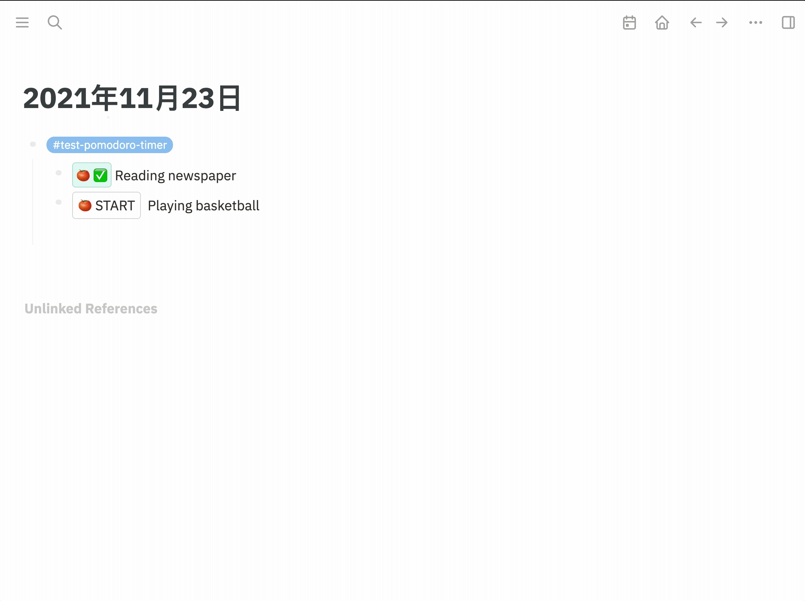

## Repository description
This repository is a fork [logseq-plugin-samples/logseq-pomodoro-timer](https://github.com/logseq/logseq-plugin-samples/tree/master/logseq-pomodoro-timer).

I mainly did the adaptation of the new version, fixed the style problem, and added the shortcut keys.
## 番茄工作法 
简体中文 | [English](./README.md)

[什么是番茄工作法?](https://zh.m.wikipedia.org/zh-hans/%E7%95%AA%E8%8C%84%E5%B7%A5%E4%BD%9C%E6%B3%95)

[如何使用？](https://www.zhihu.com/question/20189826)

This is sample that show you how to use slot ui to render block content in part :)

### Demo

### API

##### Logseq.App

- `registerSlashCommand: (tag: string, action: BlockCommandCallback | Array<SlashCommandAction>) => boolean`
- `onMacroRendererSlotted: IUserSlotHook<{ payload: { arguments: Array<string>, uuid: string, [key: string]: any } }>`

> ⚠️ The current implementation may have performance issues,
> especially when there are too many running timer instances.
> That's because time ticker needs messaging frequently between
> host and plugin sandbox. We are exploring better solutions for
> the rendering of block content partly.
 
### Running the Sample

 
- `yarn && yarn build` in terminal to install dependencies.
- `Load unpacked plugin` in Logseq Desktop client.

### License
MIT
