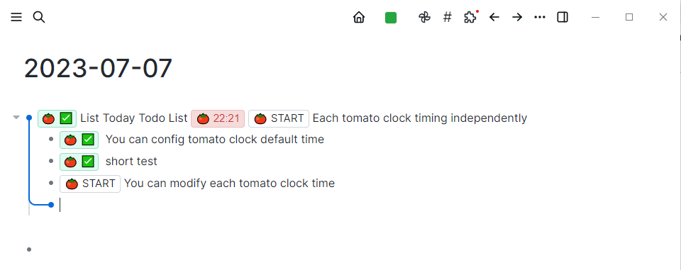

## Repository description
This repository is a fork [logseq-plugin-samples/logseq-pomodoro-timer](https://github.com/logseq/logseq-plugin-samples/tree/master/logseq-pomodoro-timer).

I mainly did the adaptation of the new version, fixed the style problem, and added the shortcut keys.
## 番茄工作法 
简体中文 | [English](./README.md)

[什么是番茄工作法?](https://zh.m.wikipedia.org/zh-hans/%E7%95%AA%E8%8C%84%E5%B7%A5%E4%BD%9C%E6%B3%95)

[如何使用？](https://www.zhihu.com/question/20189826)

### 使用
> 本插件支持在block中加入番茄时钟，可以通过消耗的番茄时钟个数计算TODO的完成时间

### 配置项

1. 配置打开快捷键，默认为`mod+o`
2. 配置番茄时钟默认时长，默认为25分钟
3. 可以修改每个番茄钟的时间

### 贡献者

### License
MIT
