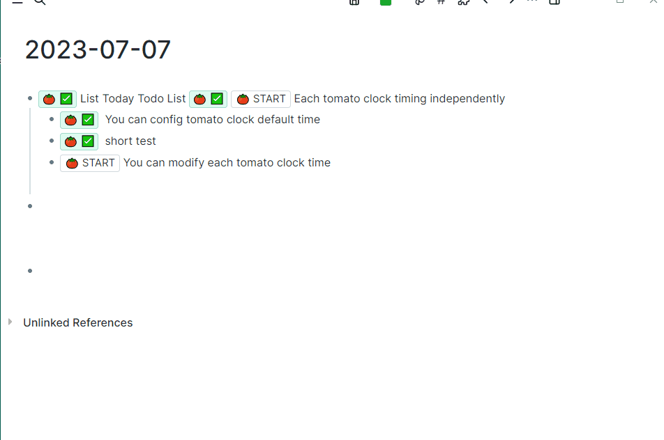

## Repository description
This repository is a fork [logseq-plugin-samples/logseq-pomodoro-timer](https://github.com/logseq/logseq-plugin-samples/tree/master/logseq-pomodoro-timer).

I mainly did the adaptation of the new version, fixed the style problem, and added the shortcut keys.
## Pomodoro Technique 
English | [简体中文](./README-zh_CN.md)

What's it? https://en.wikipedia.org/wiki/Pomodoro_Technique

This is sample that show you how to use slot ui to render block content in part :)

### Use
> This is sample that show you how to use slot ui to render block content in part :), and can calculate the completion time of TODO by the number of pomodoro time consumed

### Options

1. configure the open shortcut key
2. configure the default length of the tomato clock, the default is 25 minutes
3. Can modify each tomato clock time

### 贡献者

### License
MIT
